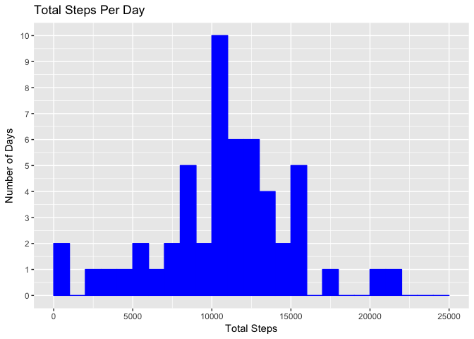
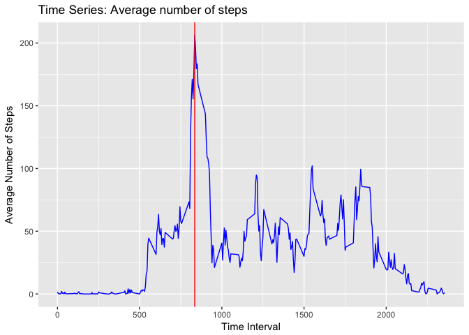
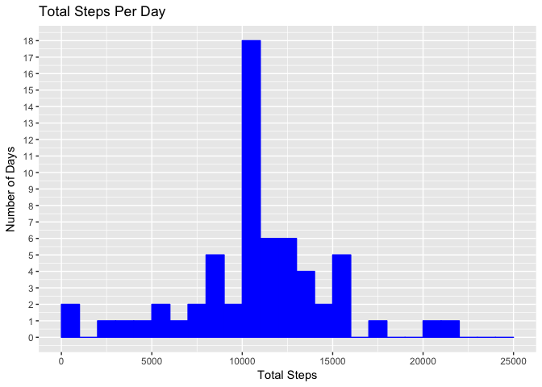
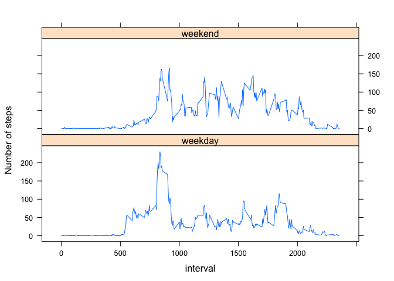

##Course Project 1:Reproducible Research, Week 2.
###Activity Monitoring Data
This assignment makes use of data from a personal activity monitoring device. This device collects data at 5 minute intervals through out the day. The data consists of two months of data from an anonymous individual collected during the months of October and November, 2012 and include the number of steps taken in 5 minute intervals each day.
from https://d396qusza40orc.cloudfront.net/repdata%2Fdata%2Factivity.zip


##Part1) Loading and Processing Data
Download, unzip and read data


```r
##library(curl)
##fileUrl <- ("https://d396qusza40orc.cloudfront.net/repdata%2Fdata%2Factivity.zip")
##download.file(fileUrl,destfile = "./activity",method = "curl")
myactivity_data <- unzip("./activity")
##1)Load data
activity_data <- read.csv(myactivity_data,header = TRUE,sep=",",na.strings="NA")
head(activity_data)
```

```
##   steps       date interval
## 1    NA 2012-10-01        0
## 2    NA 2012-10-01        5
## 3    NA 2012-10-01       10
## 4    NA 2012-10-01       15
## 5    NA 2012-10-01       20
## 6    NA 2012-10-01       25
```


##Part2)What is the total number of steps taken per day?


###1.Total steps taken daily (ignoring missing values)

```r
library(dplyr)
```

```
## 
## Attaching package: 'dplyr'
```

```
## The following objects are masked from 'package:stats':
## 
##     filter, lag
```

```
## The following objects are masked from 'package:base':
## 
##     intersect, setdiff, setequal, union
```

```r
##Make tbl_df of activity data 
activity_tbl <- tbl_df(activity_data)
##Group activty data by date using group_by() from dplyr
group_data <-group_by(activity_tbl,date)
##Calculate total steps taken daily
total_steps <- summarize(group_data,steps=sum(steps))
total_steps
```

```
## # A tibble: 61 x 2
##          date steps
##        <fctr> <int>
##  1 2012-10-01    NA
##  2 2012-10-02   126
##  3 2012-10-03 11352
##  4 2012-10-04 12116
##  5 2012-10-05 13294
##  6 2012-10-06 15420
##  7 2012-10-07 11015
##  8 2012-10-08    NA
##  9 2012-10-09 12811
## 10 2012-10-10  9900
## # ... with 51 more rows
```


###2. Histogram of total number of steps taken each day 

```r
library(ggplot2)
##Create data frame for plotting data
activity_df <- as.data.frame(total_steps)
##Plot Histogram of total number of steps using ggplot2 function ggplot()
ggplot(data=activity_df,aes(activity_df$steps)) + geom_histogram(breaks=seq(0,25000,by=1000),color="blue",fill="blue") + scale_y_continuous(breaks =seq(0,12,by=1)) + labs(title="Total Steps Per Day",x="Total Steps",y = "Number of Days")
```

```
## Warning: Removed 8 rows containing non-finite values (stat_bin).
```

<!-- -->


###3.Mean and Median of daily steps

```r
##Calculate Mean of daily steps
mean_steps <- mean(activity_df$steps,na.rm=TRUE)
mean_steps
```

```
## [1] 10766.19
```

```r
##Calculate the Median of daily steps
median_steps <- median(activity_df$steps,na.rm=TRUE)
median_steps
```

```
## [1] 10765
```
###Mean of the total number of steps taken daily is 10766.19, Median of total number of steps taken daily is 10765


##Part3) What is average daily activity pattern?


Calculate average number of steps taken daily for each 5 minute intervals across all days

```r
new_group <- group_by(activity_tbl,interval)
avg_dailysteps <- summarize(new_group,average=mean(steps,na.rm = TRUE))
##Create data frame for average daily steps 
avg_df <- as.data.frame(avg_dailysteps)
## Interval with max number of steps on average across all days
max_int <- avg_df[which.max(avg_df$average), ]
max_int
```

```
##     interval  average
## 104      835 206.1698
```


###1. Time series plot of 5 minute interval and average number of steps taken averaged across all days 

```r
ggplot(avg_dailysteps,aes(interval,average)) + geom_line(colour="blue") + geom_vline(xintercept = 835,color="red") + labs(title="Time Series: Average number of steps") + labs(x="Time Interval", y="Average Number of Steps")
```

<!-- -->


###2.Time interval that on average has maximum number of steps is 835 

##Part4) Inputting Missing Values
###1. Total number of missing values in the dataset

```r
##Find total number of missing values in the entire dataset 
missing_val <- sum(is.na(activity_data))
missing_val
```

```
## [1] 2304
```

```r
##Find which columns of original data frame have missing values(steps,date or interval)
sum(is.na(activity_data$steps))
```

```
## [1] 2304
```

```r
sum(is.na(activity_data$date))
```

```
## [1] 0
```

```r
sum(is.na(activity_data$interval))
```

```
## [1] 0
```

###There are a total of 2304 NA's in the data frame. They all occur in the steps column of data frame

###2. Replace NA's with mean for that interval 

```r
##Create tbl_df of data frame
new_tbl <- tbl_df(activity_data)
##Use chaining method of dplyr to group data by interval and calculte mean of steps
new_tbl <- new_tbl %>% group_by(interval) %>% mutate(steps=replace(steps,is.na(steps),mean(steps,na.rm=TRUE)))
```


###3. Create new data frame with no missing values (NA's replaced by mean for the interval)

```r
new_df <- as.data.frame(new_tbl)
##Check to make sure there are no missing values in new data frame
sum(is.na(new_df))
```

```
## [1] 0
```
###The new data frame has no NA's in it.


###Calculate total number of steps taken daily for new data table

```r
##Create tbl_df of new data frame 
activity_tbl2 <- tbl_df(new_tbl)
##Group data using group_by from dplyr
group_data2 <- group_by(activity_tbl2,date)
##Calculate total steps taken daily
daily_steps2 <- summarize(group_data2,steps=sum(steps))
daily_steps2
```

```
## # A tibble: 61 x 2
##          date    steps
##        <fctr>    <dbl>
##  1 2012-10-01 10766.19
##  2 2012-10-02   126.00
##  3 2012-10-03 11352.00
##  4 2012-10-04 12116.00
##  5 2012-10-05 13294.00
##  6 2012-10-06 15420.00
##  7 2012-10-07 11015.00
##  8 2012-10-08 10766.19
##  9 2012-10-09 12811.00
## 10 2012-10-10  9900.00
## # ... with 51 more rows
```

###4. Histogram of daily steps(new data frame)

```r
##Create data frame to use for plotting data
activity_df2 <- as.data.frame(daily_steps2)
ggplot(data=activity_df2,aes(activity_df2$steps)) + geom_histogram(breaks=seq(0,25000,by=1000),color="blue",fill="blue") + scale_y_continuous(breaks =seq(0,20,by=1)) + labs(title="Total Steps Per Day",x="Total Steps",y = "Number of Days")
```

<!-- -->


###Calculate new mean  and new median of daily steps(new data frame)

```r
##Calculate the new median of daily steps
new_mean <- mean(activity_df2$steps,na.rm=TRUE)
new_mean
```

```
## [1] 10766.19
```

```r
##Calculate the new median of daily steps
new_median <- median(activity_df2$steps,na.rm=TRUE)
new_median
```

```
## [1] 10766.19
```
###The new mean is 10766.19 and the new median is 10766.19 for the filled in data frame

###Is there a diffrence between inital mean and median and new mean and median? 

```r
##Is new mean equal to old mean
mean_steps==new_mean
```

```
## [1] TRUE
```

```r
##Is new median equal to old median
median_steps==new_median
```

```
## [1] FALSE
```

```r
##Calculate the difference between the two medians
new_median-median_steps
```

```
## [1] 1.188679
```
Mean:There is no change in mean of daily steps 
original mean = 10766.19 (from original data frame) and new mean = 10766.19 (from data frame with NA values replaced by mean for that interval)

Median:Only slight change in median 
Original median = 10765 (from original data frame) and new median = 10766.19 (from data frame with NA values replaced by mean for that interval)

###The number of days that have interval with maximum number of steps has increased
###Replacing NA values with mean of that interval does not change the mean of number of daily steps and the change to the median number of steps is just 1.188679 which is negligible

###Therefore in conclusion inputting data(from average values for that interval) does not have an impact on the total number of daily steps. However, the number of days for whcih the maximum number of steps occur goes up from 10 days to 18 days after inputting the missing data, which implies that many of the missing values may have been from that interval.

##Part5)Are there differences in activity patterns between weekdays and weekends?


###1.Create new column with factor varaible with two levels "weekdays" and "weekends"

```r
##Convert date column to a date time class using as.Date
new_df$date <- as.Date(new_df$date,"%Y-%m-%d")
```

```
## Warning in strptime(x, format, tz = "GMT"): unknown timezone 'zone/tz/
## 2017c.1.0/zoneinfo/America/New_York'
```

```r
##Create a new column to display the day of the week for each day 
new_df$day <- weekdays(new_df$date)
##Create new column weekday to display if it is a weekday or weekend
new_df$weekday <- ifelse(new_df$day=="Saturday"|new_df$day=="Sunday","weekend","weekday")
##Convert weekday column to factor with two levels weekday and weekend
new_df$weekday <- as.factor(new_df$weekday)
```


###2.Panel plot with time series of 5 minute interval(x axis) and average number of steps taken(y axis), averaged across all weekdays and weekend days

```r
##Calculate average daily steps for 5 minute interval across all weekdays and weekend days
##Make tbl_df of new data frame 
library(lattice)
my_tbl <- tbl_df(new_df)
##Group data by interval and weekday
mynew_group <- group_by(my_tbl,interval,weekday)
##Calculate average of steps for grouped dat
newavg_dailysteps <- summarize(mynew_group,average=mean(steps,na.rm = TRUE))
##Create data frame using as.data.frame
newavg_df <- as.data.frame(newavg_dailysteps)
##Create Panel plot Time series with above data
xyplot(average~interval|weekday,data=newavg_df,type="l",layout=c(1,2),ylab = "Number of steps")
```

<!-- -->

###There are some differences in activity pattern between weekdays and weekends. 
###The maximum number of steps on average (across all intervals and all days) occur during the 835 interval of a weekday
###The activity during weekend days is spread out over larger number of intervals(~interval 88 to about 2000) during the day. Whereas on weekdays activity spikes mainly around interval 835 to 1000 and then there is less activity during the remaining intervals of the weekdays.
